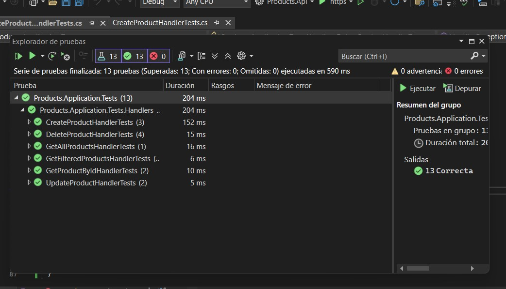
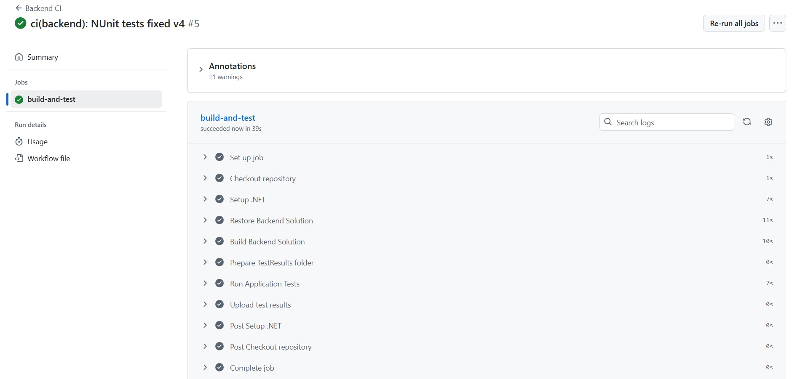

# Products
Proyecto .Net con DDD (Domain-Driven Design), CQRS, Result<T>, Repository, SOLID, Clean Architecture, utiliza JWT Bearer Authentication con políticas para la seguridad, se aplico workflow para integración continua y despliegue continuo (CI/CD) en GitHub Actions y se implementaron Test con NUnit.

## Cómo ejecutar el proyecto

### Requisitos
- [.NET 8 SDK]
- Postman 
- Collection Postman Products\docs\Products API.postman_collection.json

### Pasos
1. Clonar el repositorio:
git clone https://github.com/maicol9310/Products.git

2. Ir a la carpeta del proyecto API:
cd src/Products.Api

3. Restaurar dependencias:
dotnet restore Products.Api.sln

4. Compilar la solución:
dotnet build Products.Api.sln --configuration Release

5. Ejecutar la API:
dotnet run --project Products.Api/Products.Api.csproj

## Decisiones técnicas

- DDD (Domain-Driven Design): Separación en proyectos Domain, Application, Infrastructure y SharedKernel para mantener arquitectura limpia y Application.Abstractions para no mezcla la Infrastructura con Application y no romper DDD, por ultimo un proyecto Test con NUnit.

- CQRS: Comandos y consultas manejados por separado usando MediatR.

- Dapper: ORM para acceso a base de datos de en memoria.

- AutoMapper: Mappeo de entidades de dominio a DTOs.

- FluentValidation: Reglas de validación de comandos.

- SQLite (In-Memory): Base de datos.

- NUnit + Moq: Framework de pruebas unitarias y mocks para la capa de aplicación.

- GitHub Actions CI/CD: Flujo de trabajo automatizado.

- Resul<T> para el manejo de errores y exito.

- Repository para el majeno de interfaces entre capas.

- JWT con politicas de acceso para la seguridad en los endpoints.

## Endpoints de la API

- GET /api/products - Obtener todos los productos.

- GET /api/products/{id} - Obtener un producto por ID.

- GET /api/products/filter?categoria={cat}&preciomin={min} - Filtrar productos por categoría y precio mínimo.

- POST /api/products - Crear un nuevo producto.

- PUT /api/products/{id} - Actualizar un producto existente.

- DELETE /api/products/{id} - Eliminar un producto.

- POST /login?username=Admin&role=Admin

## Cobertura de Test

## 👥 Autor

**Jan Michael Sánchez**
Desarrollador de software especializado en soluciones distribuidas, arquitectura limpia y desarrollo web fullstack.

📧 **Contacto:** [[maicol_931028@hotmail.com](mailto:maicol_931028@hotmail.com)]
🌐 **GitHub:** [@maicol9310](https://github.com/maicol9310)